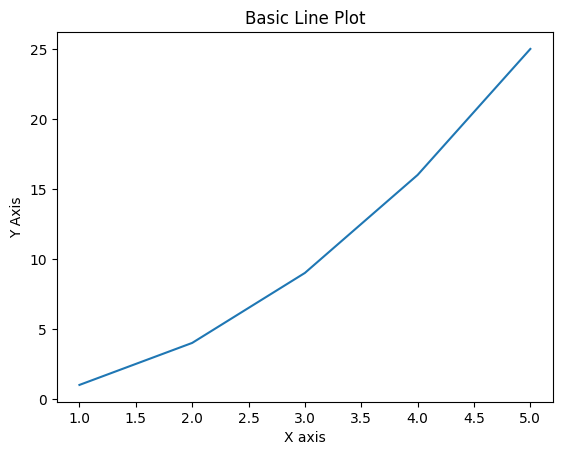
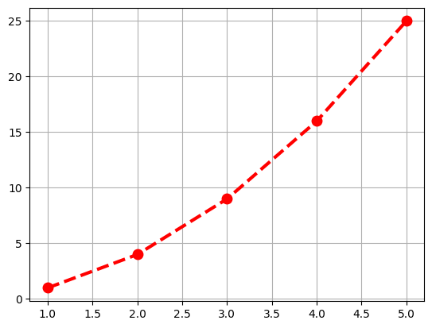
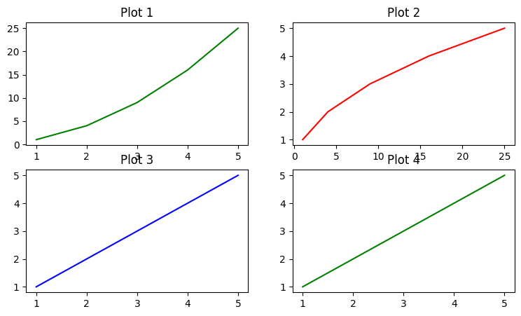
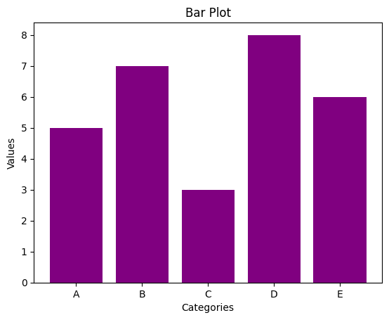
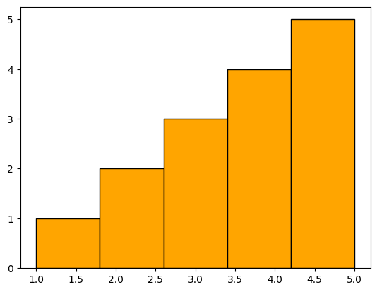
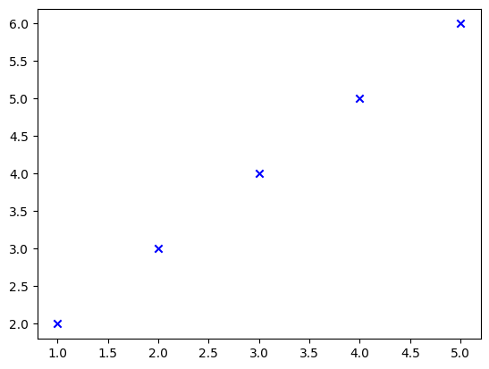
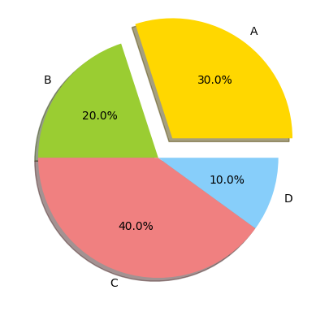
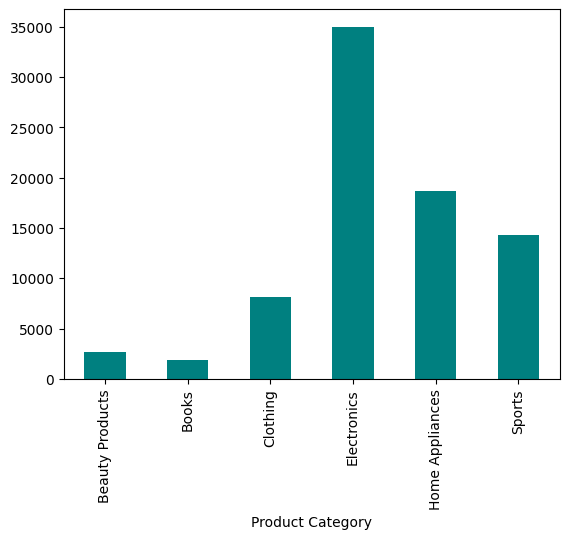
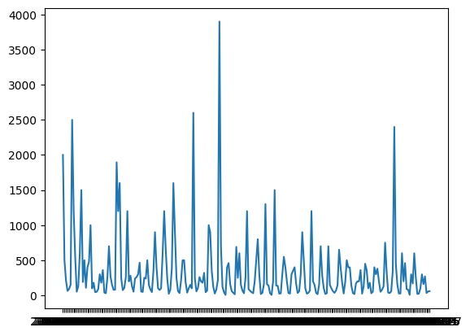

#### Data Visualization With Matplotlib

Matplotlib is a powerful plotting library for Python that enables the creation of static, animated, and interactive visualizations. It is widely used for data visualization in data science and analytics. In this lesson, we will cover the basics of Matplotlib, including creating various types of plots and customizing them.


```python
!pip install matplotlib
```

    Requirement already satisfied: matplotlib in e:\udemy final\python\venv\lib\site-packages (3.9.0)
    Requirement already satisfied: contourpy>=1.0.1 in e:\udemy final\python\venv\lib\site-packages (from matplotlib) (1.2.1)
    Requirement already satisfied: cycler>=0.10 in e:\udemy final\python\venv\lib\site-packages (from matplotlib) (0.12.1)
    Requirement already satisfied: fonttools>=4.22.0 in e:\udemy final\python\venv\lib\site-packages (from matplotlib) (4.53.0)
    Requirement already satisfied: kiwisolver>=1.3.1 in e:\udemy final\python\venv\lib\site-packages (from matplotlib) (1.4.5)
    Requirement already satisfied: numpy>=1.23 in e:\udemy final\python\venv\lib\site-packages (from matplotlib) (1.26.4)
    Requirement already satisfied: packaging>=20.0 in e:\udemy final\python\venv\lib\site-packages (from matplotlib) (24.0)
    Requirement already satisfied: pillow>=8 in e:\udemy final\python\venv\lib\site-packages (from matplotlib) (10.3.0)
    Requirement already satisfied: pyparsing>=2.3.1 in e:\udemy final\python\venv\lib\site-packages (from matplotlib) (3.1.2)
    Requirement already satisfied: python-dateutil>=2.7 in e:\udemy final\python\venv\lib\site-packages (from matplotlib) (2.9.0.post0)
    Requirement already satisfied: six>=1.5 in e:\udemy final\python\venv\lib\site-packages (from python-dateutil>=2.7->matplotlib) (1.16.0)


```python
import matplotlib.pyplot as plt
```


```python
x=[1,2,3,4,5]
y=[1,4,9,16,25]

##create a line plot
plt.plot(x,y)
plt.xlabel('X axis')
plt.ylabel('Y Axis')
plt.title("Basic Line Plot")
plt.show()
```


    

    


```python
x=[1,2,3,4,5]
y=[1,4,9,16,25]

##create a customized line plot

plt.plot(x,y,color='red',linestyle='--',marker='o',linewidth=3,markersize=9)
plt.grid(True)

```


    

    


```python
## Multiple Plots
## Sample data
x = [1, 2, 3, 4, 5]
y1 = [1, 4, 9, 16, 25]
y2 = [1, 2, 3, 4, 5]

plt.figure(figsize=(9,5))

plt.subplot(2,2,1)
plt.plot(x,y1,color='green')
plt.title("Plot 1")

plt.subplot(2,2,2)
plt.plot(y1,x,color='red')
plt.title("Plot 2")

plt.subplot(2,2,3)
plt.plot(x,y2,color='blue')
plt.title("Plot 3")

plt.subplot(2,2,4)
plt.plot(x,y2,color='green')
plt.title("Plot 4")

```


    Text(0.5, 1.0, 'Plot 4')


    

    


```python
###Bar Plor
categories=['A','B','C','D','E']
values=[5,7,3,8,6]

##create a bar plot
plt.bar(categories,values,color='purple')
plt.xlabel('Categories')
plt.ylabel('Values')
plt.title('Bar Plot')
plt.show()
```


    

    


#### Histograms
Histograms are used to represent the distribution of a dataset. They divide the data into bins and count the number of data points in each bin.


```python
# Sample data
data = [1, 2, 2, 3, 3, 3, 4, 4, 4, 4, 5, 5, 5, 5, 5]

##create a histogram
plt.hist(data,bins=5,color='orange',edgecolor='black')
```


    (array([1., 2., 3., 4., 5.]),
     array([1. , 1.8, 2.6, 3.4, 4.2, 5. ]),
     <BarContainer object of 5 artists>)


    

    


```python
##create a scatter plot
# Sample data
x = [1, 2, 3, 4, 5]
y = [2, 3, 4, 5, 6]

plt.scatter(x,y,color="blue",marker='x')
```


    <matplotlib.collections.PathCollection at 0x25699a6b080>


    

    


```python
### pie chart

labels=['A','B','C','D']
sizes=[30,20,40,10]
colors=['gold','yellowgreen','lightcoral','lightskyblue']
explode=(0.2,0,0,0) ##move out the 1st slice

##create apie chart
plt.pie(sizes,explode=explode,labels=labels,colors=colors,autopct="%1.1f%%",shadow=True)
```


    ([<matplotlib.patches.Wedge at 0x2569ea3ca10>,
      <matplotlib.patches.Wedge at 0x2569ea3c8f0>,
      <matplotlib.patches.Wedge at 0x2569ea3d4f0>,
      <matplotlib.patches.Wedge at 0x2569ea3dbb0>],
     [Text(0.764120788592483, 1.051722121304293, 'A'),
      Text(-0.8899187482945419, 0.6465637025335369, 'B'),
      Text(-0.3399185762739153, -1.046162206115244, 'C'),
      Text(1.0461622140716127, -0.3399185517867209, 'D')],
     [Text(0.47022817759537416, 0.6472136131103341, '30.0%'),
      Text(-0.4854102263424773, 0.3526711104728383, '20.0%'),
      Text(-0.1854101325130447, -0.5706339306083149, '40.0%'),
      Text(0.5706339349481523, -0.18541011915639322, '10.0%')])


    

    


```python
## Sales Data Visualization
import pandas as pd
sales_data_df=pd.read_csv('sales_data.csv')
sales_data_df.head(5)
```


<div>
<style scoped>
    .dataframe tbody tr th:only-of-type {
        vertical-align: middle;
    }

    .dataframe tbody tr th {
        vertical-align: top;
    }

    .dataframe thead th {
        text-align: right;
    }
</style>
<table border="1" class="dataframe">
  <thead>
    <tr style="text-align: right;">
      <th></th>
      <th>Transaction ID</th>
      <th>Date</th>
      <th>Product Category</th>
      <th>Product Name</th>
      <th>Units Sold</th>
      <th>Unit Price</th>
      <th>Total Revenue</th>
      <th>Region</th>
      <th>Payment Method</th>
    </tr>
  </thead>
  <tbody>
    <tr>
      <th>0</th>
      <td>10001</td>
      <td>2024-01-01</td>
      <td>Electronics</td>
      <td>iPhone 14 Pro</td>
      <td>2</td>
      <td>999.99</td>
      <td>1999.98</td>
      <td>North America</td>
      <td>Credit Card</td>
    </tr>
    <tr>
      <th>1</th>
      <td>10002</td>
      <td>2024-01-02</td>
      <td>Home Appliances</td>
      <td>Dyson V11 Vacuum</td>
      <td>1</td>
      <td>499.99</td>
      <td>499.99</td>
      <td>Europe</td>
      <td>PayPal</td>
    </tr>
    <tr>
      <th>2</th>
      <td>10003</td>
      <td>2024-01-03</td>
      <td>Clothing</td>
      <td>Levi's 501 Jeans</td>
      <td>3</td>
      <td>69.99</td>
      <td>209.97</td>
      <td>Asia</td>
      <td>Debit Card</td>
    </tr>
    <tr>
      <th>3</th>
      <td>10004</td>
      <td>2024-01-04</td>
      <td>Books</td>
      <td>The Da Vinci Code</td>
      <td>4</td>
      <td>15.99</td>
      <td>63.96</td>
      <td>North America</td>
      <td>Credit Card</td>
    </tr>
    <tr>
      <th>4</th>
      <td>10005</td>
      <td>2024-01-05</td>
      <td>Beauty Products</td>
      <td>Neutrogena Skincare Set</td>
      <td>1</td>
      <td>89.99</td>
      <td>89.99</td>
      <td>Europe</td>
      <td>PayPal</td>
    </tr>
  </tbody>
</table>
</div>


```python
sales_data_df.info()
```

    <class 'pandas.core.frame.DataFrame'>
    RangeIndex: 240 entries, 0 to 239
    Data columns (total 9 columns):
     #   Column            Non-Null Count  Dtype  
    ---  ------            --------------  -----  
     0   Transaction ID    240 non-null    int64  
     1   Date              240 non-null    object 
     2   Product Category  240 non-null    object 
     3   Product Name      240 non-null    object 
     4   Units Sold        240 non-null    int64  
     5   Unit Price        240 non-null    float64
     6   Total Revenue     240 non-null    float64
     7   Region            240 non-null    object 
     8   Payment Method    240 non-null    object 
    dtypes: float64(2), int64(2), object(5)
    memory usage: 17.0+ KB


```python
## plot total sales by products
total_sales_by_product=sales_data_df.groupby('Product Category')['Total Revenue'].sum()
print(total_sales_by_product)
```

    Product Category
    Beauty Products     2621.90
    Books               1861.93
    Clothing            8128.93
    Electronics        34982.41
    Home Appliances    18646.16
    Sports             14326.52
    Name: Total Revenue, dtype: float64


```python
total_sales_by_product.plot(kind='bar',color='teal')
```


    <Axes: xlabel='Product Category'>


    

    


```python
## plot sales trend over time
sales_trend=sales_data_df.groupby('Date')['Total Revenue'].sum().reset_index()
plt.plot(sales_trend['Date'],sales_trend['Total Revenue'])
```


    [<matplotlib.lines.Line2D at 0x2569e9b46e0>]


    

    


```python

```


```python

```
