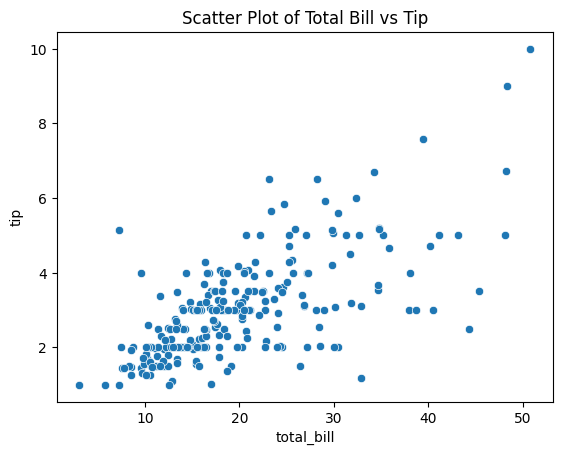
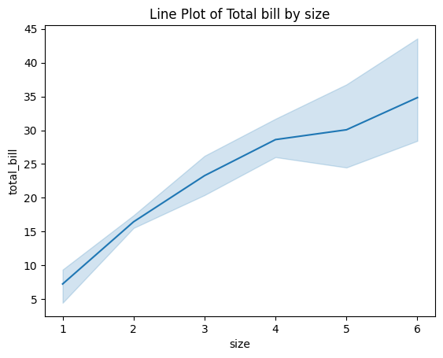
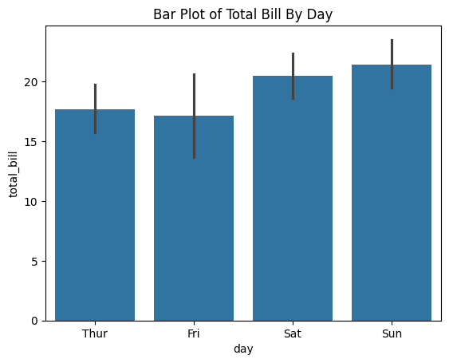
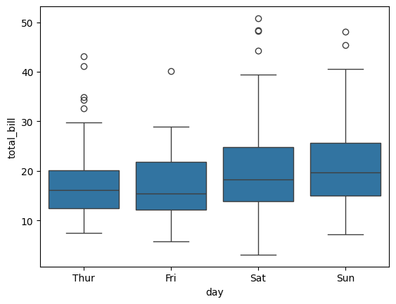
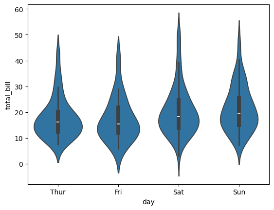
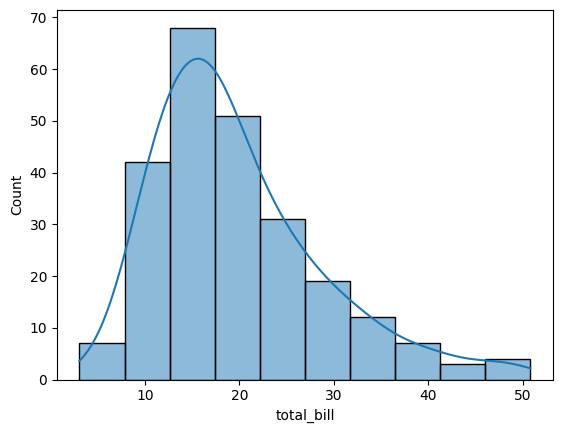
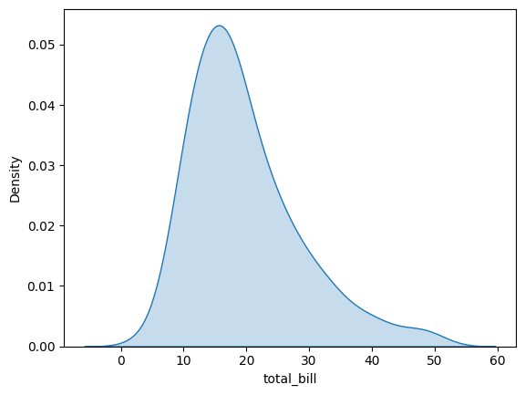
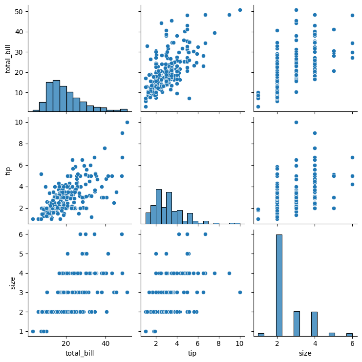
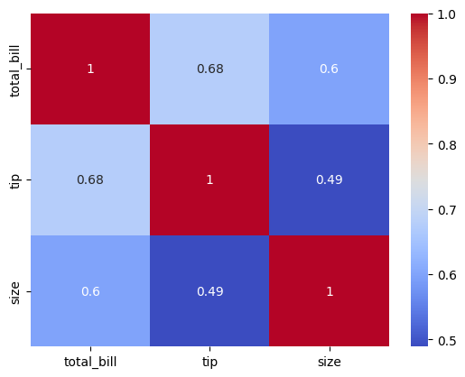
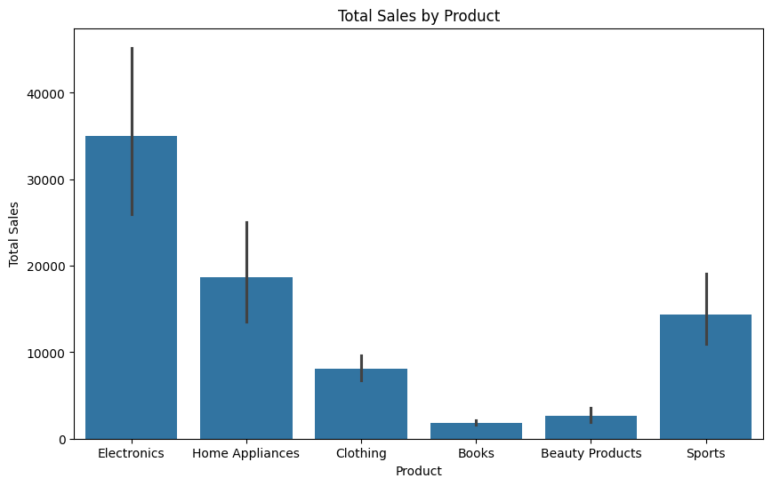

#### Data Visualization With Seaborn
Seaborn is a Python visualization library based on Matplotlib that provides a high-level interface for drawing attractive and informative statistical graphics. Seaborn helps in creating complex visualizations with just a few lines of code. In this lesson, we will cover the basics of Seaborn, including creating various types of plots and customizing them. 


```python
!pip install seaborn
```

    Collecting seaborn
      Downloading seaborn-0.13.2-py3-none-any.whl.metadata (5.4 kB)
    Requirement already satisfied: numpy!=1.24.0,>=1.20 in e:\udemy final\python\venv\lib\site-packages (from seaborn) (1.26.4)
    Requirement already satisfied: pandas>=1.2 in e:\udemy final\python\venv\lib\site-packages (from seaborn) (2.2.2)
    Requirement already satisfied: matplotlib!=3.6.1,>=3.4 in e:\udemy final\python\venv\lib\site-packages (from seaborn) (3.9.0)
    Requirement already satisfied: contourpy>=1.0.1 in e:\udemy final\python\venv\lib\site-packages (from matplotlib!=3.6.1,>=3.4->seaborn) (1.2.1)
    Requirement already satisfied: cycler>=0.10 in e:\udemy final\python\venv\lib\site-packages (from matplotlib!=3.6.1,>=3.4->seaborn) (0.12.1)
    Requirement already satisfied: fonttools>=4.22.0 in e:\udemy final\python\venv\lib\site-packages (from matplotlib!=3.6.1,>=3.4->seaborn) (4.53.0)
    Requirement already satisfied: kiwisolver>=1.3.1 in e:\udemy final\python\venv\lib\site-packages (from matplotlib!=3.6.1,>=3.4->seaborn) (1.4.5)
    Requirement already satisfied: packaging>=20.0 in e:\udemy final\python\venv\lib\site-packages (from matplotlib!=3.6.1,>=3.4->seaborn) (24.0)
    Requirement already satisfied: pillow>=8 in e:\udemy final\python\venv\lib\site-packages (from matplotlib!=3.6.1,>=3.4->seaborn) (10.3.0)
    Requirement already satisfied: pyparsing>=2.3.1 in e:\udemy final\python\venv\lib\site-packages (from matplotlib!=3.6.1,>=3.4->seaborn) (3.1.2)
    Requirement already satisfied: python-dateutil>=2.7 in e:\udemy final\python\venv\lib\site-packages (from matplotlib!=3.6.1,>=3.4->seaborn) (2.9.0.post0)
    Requirement already satisfied: pytz>=2020.1 in e:\udemy final\python\venv\lib\site-packages (from pandas>=1.2->seaborn) (2024.1)
    Requirement already satisfied: tzdata>=2022.7 in e:\udemy final\python\venv\lib\site-packages (from pandas>=1.2->seaborn) (2024.1)
    Requirement already satisfied: six>=1.5 in e:\udemy final\python\venv\lib\site-packages (from python-dateutil>=2.7->matplotlib!=3.6.1,>=3.4->seaborn) (1.16.0)
    Downloading seaborn-0.13.2-py3-none-any.whl (294 kB)
       ---------------------------------------- 0.0/294.9 kB ? eta -:--:--
       -- ------------------------------------ 20.5/294.9 kB 330.3 kB/s eta 0:00:01
       -- ------------------------------------ 20.5/294.9 kB 330.3 kB/s eta 0:00:01
       -- ------------------------------------ 20.5/294.9 kB 330.3 kB/s eta 0:00:01
       ---------- ---------------------------- 81.9/294.9 kB 416.7 kB/s eta 0:00:01
       ------------------------- ------------ 194.6/294.9 kB 908.0 kB/s eta 0:00:01
       ---------------------------------------- 294.9/294.9 kB 1.2 MB/s eta 0:00:00
    Installing collected packages: seaborn
    Successfully installed seaborn-0.13.2


```python
import seaborn as sns
```


```python
### Basic Plotting With Seaborn
tips=sns.load_dataset('tips')
tips
```


<div>
<style scoped>
    .dataframe tbody tr th:only-of-type {
        vertical-align: middle;
    }

    .dataframe tbody tr th {
        vertical-align: top;
    }

    .dataframe thead th {
        text-align: right;
    }
</style>
<table border="1" class="dataframe">
  <thead>
    <tr style="text-align: right;">
      <th></th>
      <th>total_bill</th>
      <th>tip</th>
      <th>sex</th>
      <th>smoker</th>
      <th>day</th>
      <th>time</th>
      <th>size</th>
    </tr>
  </thead>
  <tbody>
    <tr>
      <th>0</th>
      <td>16.99</td>
      <td>1.01</td>
      <td>Female</td>
      <td>No</td>
      <td>Sun</td>
      <td>Dinner</td>
      <td>2</td>
    </tr>
    <tr>
      <th>1</th>
      <td>10.34</td>
      <td>1.66</td>
      <td>Male</td>
      <td>No</td>
      <td>Sun</td>
      <td>Dinner</td>
      <td>3</td>
    </tr>
    <tr>
      <th>2</th>
      <td>21.01</td>
      <td>3.50</td>
      <td>Male</td>
      <td>No</td>
      <td>Sun</td>
      <td>Dinner</td>
      <td>3</td>
    </tr>
    <tr>
      <th>3</th>
      <td>23.68</td>
      <td>3.31</td>
      <td>Male</td>
      <td>No</td>
      <td>Sun</td>
      <td>Dinner</td>
      <td>2</td>
    </tr>
    <tr>
      <th>4</th>
      <td>24.59</td>
      <td>3.61</td>
      <td>Female</td>
      <td>No</td>
      <td>Sun</td>
      <td>Dinner</td>
      <td>4</td>
    </tr>
    <tr>
      <th>...</th>
      <td>...</td>
      <td>...</td>
      <td>...</td>
      <td>...</td>
      <td>...</td>
      <td>...</td>
      <td>...</td>
    </tr>
    <tr>
      <th>239</th>
      <td>29.03</td>
      <td>5.92</td>
      <td>Male</td>
      <td>No</td>
      <td>Sat</td>
      <td>Dinner</td>
      <td>3</td>
    </tr>
    <tr>
      <th>240</th>
      <td>27.18</td>
      <td>2.00</td>
      <td>Female</td>
      <td>Yes</td>
      <td>Sat</td>
      <td>Dinner</td>
      <td>2</td>
    </tr>
    <tr>
      <th>241</th>
      <td>22.67</td>
      <td>2.00</td>
      <td>Male</td>
      <td>Yes</td>
      <td>Sat</td>
      <td>Dinner</td>
      <td>2</td>
    </tr>
    <tr>
      <th>242</th>
      <td>17.82</td>
      <td>1.75</td>
      <td>Male</td>
      <td>No</td>
      <td>Sat</td>
      <td>Dinner</td>
      <td>2</td>
    </tr>
    <tr>
      <th>243</th>
      <td>18.78</td>
      <td>3.00</td>
      <td>Female</td>
      <td>No</td>
      <td>Thur</td>
      <td>Dinner</td>
      <td>2</td>
    </tr>
  </tbody>
</table>
<p>244 rows × 7 columns</p>
</div>


```python
##create a scatter plot
import matplotlib.pyplot as plt

sns.scatterplot(x='total_bill',y='tip',data=tips)
plt.title("Scatter Plot of Total Bill vs Tip")
plt.show()
```


    

    


```python
## Line Plot

sns.lineplot(x='size',y='total_bill',data=tips)
plt.title("Line Plot of Total bill by size")
plt.show()
```


    

    


```python
## Categorical Plots
## BAr Plot
sns.barplot(x='day',y='total_bill',data=tips)
plt.title('Bar Plot of Total Bill By Day')
plt.show()
```


    

    


```python
## Box Plot
sns.boxplot(x="day",y='total_bill',data=tips)
```


    <Axes: xlabel='day', ylabel='total_bill'>


    

    


```python
## Violin Plot

sns.violinplot(x='day',y='total_bill',data=tips)
```


    <Axes: xlabel='day', ylabel='total_bill'>


    

    


```python
### Histograms
sns.histplot(tips['total_bill'],bins=10,kde=True)
```


    <Axes: xlabel='total_bill', ylabel='Count'>


    

    


```python
## KDE Plot
sns.kdeplot(tips['total_bill'],fill=True)
```


    <Axes: xlabel='total_bill', ylabel='Density'>


    

    


```python
# Pairplot
sns.pairplot(tips)
```


    <seaborn.axisgrid.PairGrid at 0x27547277770>


    

    


```python
tips
```


<div>
<style scoped>
    .dataframe tbody tr th:only-of-type {
        vertical-align: middle;
    }

    .dataframe tbody tr th {
        vertical-align: top;
    }

    .dataframe thead th {
        text-align: right;
    }
</style>
<table border="1" class="dataframe">
  <thead>
    <tr style="text-align: right;">
      <th></th>
      <th>total_bill</th>
      <th>tip</th>
      <th>sex</th>
      <th>smoker</th>
      <th>day</th>
      <th>time</th>
      <th>size</th>
    </tr>
  </thead>
  <tbody>
    <tr>
      <th>0</th>
      <td>16.99</td>
      <td>1.01</td>
      <td>Female</td>
      <td>No</td>
      <td>Sun</td>
      <td>Dinner</td>
      <td>2</td>
    </tr>
    <tr>
      <th>1</th>
      <td>10.34</td>
      <td>1.66</td>
      <td>Male</td>
      <td>No</td>
      <td>Sun</td>
      <td>Dinner</td>
      <td>3</td>
    </tr>
    <tr>
      <th>2</th>
      <td>21.01</td>
      <td>3.50</td>
      <td>Male</td>
      <td>No</td>
      <td>Sun</td>
      <td>Dinner</td>
      <td>3</td>
    </tr>
    <tr>
      <th>3</th>
      <td>23.68</td>
      <td>3.31</td>
      <td>Male</td>
      <td>No</td>
      <td>Sun</td>
      <td>Dinner</td>
      <td>2</td>
    </tr>
    <tr>
      <th>4</th>
      <td>24.59</td>
      <td>3.61</td>
      <td>Female</td>
      <td>No</td>
      <td>Sun</td>
      <td>Dinner</td>
      <td>4</td>
    </tr>
    <tr>
      <th>...</th>
      <td>...</td>
      <td>...</td>
      <td>...</td>
      <td>...</td>
      <td>...</td>
      <td>...</td>
      <td>...</td>
    </tr>
    <tr>
      <th>239</th>
      <td>29.03</td>
      <td>5.92</td>
      <td>Male</td>
      <td>No</td>
      <td>Sat</td>
      <td>Dinner</td>
      <td>3</td>
    </tr>
    <tr>
      <th>240</th>
      <td>27.18</td>
      <td>2.00</td>
      <td>Female</td>
      <td>Yes</td>
      <td>Sat</td>
      <td>Dinner</td>
      <td>2</td>
    </tr>
    <tr>
      <th>241</th>
      <td>22.67</td>
      <td>2.00</td>
      <td>Male</td>
      <td>Yes</td>
      <td>Sat</td>
      <td>Dinner</td>
      <td>2</td>
    </tr>
    <tr>
      <th>242</th>
      <td>17.82</td>
      <td>1.75</td>
      <td>Male</td>
      <td>No</td>
      <td>Sat</td>
      <td>Dinner</td>
      <td>2</td>
    </tr>
    <tr>
      <th>243</th>
      <td>18.78</td>
      <td>3.00</td>
      <td>Female</td>
      <td>No</td>
      <td>Thur</td>
      <td>Dinner</td>
      <td>2</td>
    </tr>
  </tbody>
</table>
<p>244 rows × 7 columns</p>
</div>


```python
## HEatmap
corr=tips[['total_bill','tip','size']].corr()
corr
```


<div>
<style scoped>
    .dataframe tbody tr th:only-of-type {
        vertical-align: middle;
    }

    .dataframe tbody tr th {
        vertical-align: top;
    }

    .dataframe thead th {
        text-align: right;
    }
</style>
<table border="1" class="dataframe">
  <thead>
    <tr style="text-align: right;">
      <th></th>
      <th>total_bill</th>
      <th>tip</th>
      <th>size</th>
    </tr>
  </thead>
  <tbody>
    <tr>
      <th>total_bill</th>
      <td>1.000000</td>
      <td>0.675734</td>
      <td>0.598315</td>
    </tr>
    <tr>
      <th>tip</th>
      <td>0.675734</td>
      <td>1.000000</td>
      <td>0.489299</td>
    </tr>
    <tr>
      <th>size</th>
      <td>0.598315</td>
      <td>0.489299</td>
      <td>1.000000</td>
    </tr>
  </tbody>
</table>
</div>


```python
sns.heatmap(corr,annot=True,cmap='coolwarm')

```


    <Axes: >


    

    


```python
import pandas as pd
sales_df=pd.read_csv('sales_data.csv')
sales_df.head()
```


<div>
<style scoped>
    .dataframe tbody tr th:only-of-type {
        vertical-align: middle;
    }

    .dataframe tbody tr th {
        vertical-align: top;
    }

    .dataframe thead th {
        text-align: right;
    }
</style>
<table border="1" class="dataframe">
  <thead>
    <tr style="text-align: right;">
      <th></th>
      <th>Transaction ID</th>
      <th>Date</th>
      <th>Product Category</th>
      <th>Product Name</th>
      <th>Units Sold</th>
      <th>Unit Price</th>
      <th>Total Revenue</th>
      <th>Region</th>
      <th>Payment Method</th>
    </tr>
  </thead>
  <tbody>
    <tr>
      <th>0</th>
      <td>10001</td>
      <td>2024-01-01</td>
      <td>Electronics</td>
      <td>iPhone 14 Pro</td>
      <td>2</td>
      <td>999.99</td>
      <td>1999.98</td>
      <td>North America</td>
      <td>Credit Card</td>
    </tr>
    <tr>
      <th>1</th>
      <td>10002</td>
      <td>2024-01-02</td>
      <td>Home Appliances</td>
      <td>Dyson V11 Vacuum</td>
      <td>1</td>
      <td>499.99</td>
      <td>499.99</td>
      <td>Europe</td>
      <td>PayPal</td>
    </tr>
    <tr>
      <th>2</th>
      <td>10003</td>
      <td>2024-01-03</td>
      <td>Clothing</td>
      <td>Levi's 501 Jeans</td>
      <td>3</td>
      <td>69.99</td>
      <td>209.97</td>
      <td>Asia</td>
      <td>Debit Card</td>
    </tr>
    <tr>
      <th>3</th>
      <td>10004</td>
      <td>2024-01-04</td>
      <td>Books</td>
      <td>The Da Vinci Code</td>
      <td>4</td>
      <td>15.99</td>
      <td>63.96</td>
      <td>North America</td>
      <td>Credit Card</td>
    </tr>
    <tr>
      <th>4</th>
      <td>10005</td>
      <td>2024-01-05</td>
      <td>Beauty Products</td>
      <td>Neutrogena Skincare Set</td>
      <td>1</td>
      <td>89.99</td>
      <td>89.99</td>
      <td>Europe</td>
      <td>PayPal</td>
    </tr>
  </tbody>
</table>
</div>


```python
## Plot total sales by product
plt.figure(figsize=(10,6))
sns.barplot(x='Product Category',y="Total Revenue",data=sales_df,estimator=sum)
plt.title('Total Sales by Product')
plt.xlabel('Product')
plt.ylabel('Total Sales')
plt.show()
```


    

    


```python
## Plot total sales by Region
plt.figure(figsize=(10,6))
sns.barplot(x='Region',y="Total Revenue",data=sales_df,estimator=sum)
plt.title('Total Sales by Region')
plt.xlabel('Region')
plt.ylabel('Total Sales')
plt.show()
```


```python

```
